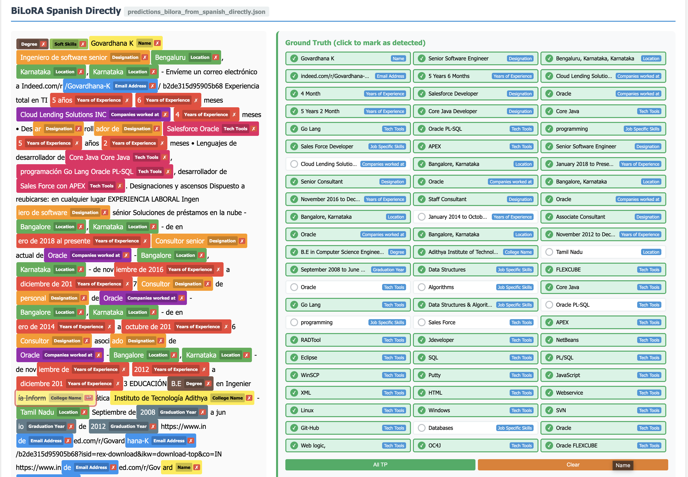

A repo containing code for "MultiHead-LLM: Unified Quantized LLM Architecture for Efficient Resume Classification and Multilingual Named Entity Recognition"



## Structure

```
.
├── Llama_format_NER.ipynb                                  # BiLoRA NER: training + evaluation
├── Llama format NER Multilingual (Without training).ipynb  # Multilingual inference template
└── mutlilingual-validation-app/                            # Prediction validation tooling
    ├── ner_validation_app.html                             # Interactive viewer
    ├── process_ner_files.py                                # Merges predictions + ground truth
    ├── combined_ner_results_schema.json                    # Merged-file JSON schema
    └── README.md                                           # App / data-prep documentation
```


