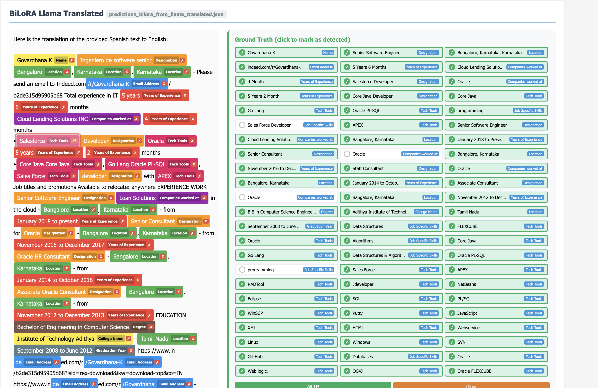
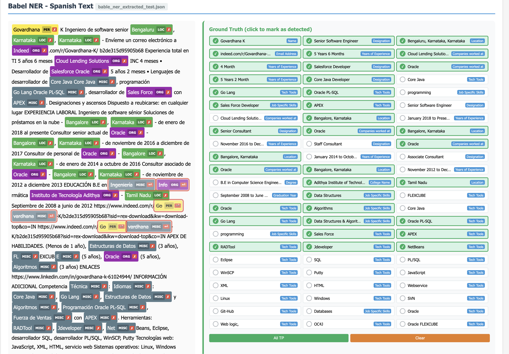
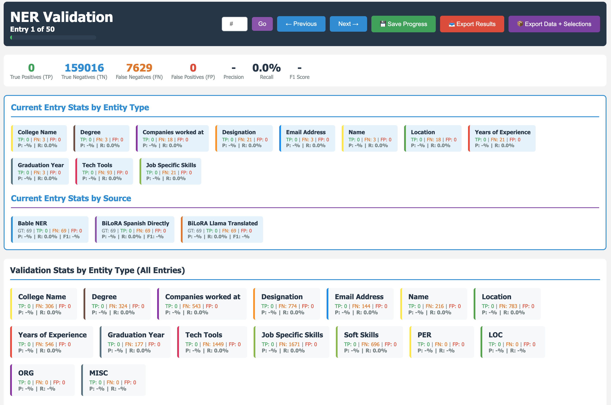

# Multilingual NER Pipeline

This directory contains the pipeline for combining and evaluating three multilingual NER approaches applied to CV/resume data.

## Overview

Three NER systems are compared against English ground truth labels on the same test set:

| Approach | Description |
|---|---|
| **BiLoRA Spanish Directly** | BiLoRA model applied to text translated directly to Spanish |
| **BiLoRA LLaMA Translated** | BiLoRA model applied to text translated via LLaMA, with back-translation |
| **BabelNER** | BabelBert-based multilingual NER applied to Spanish text |

### BiLoRA Spanish Directly


### BiLoRA LLaMA Translated


### Wiki NER


### Analysis


## Input Files

| File | Format | Description |
|---|---|---|
| `test.json` | JSONL | Ground truth — one entry per line with `text`, `id`, and character-offset `labels` |
| `predictions_bilora_from_spanish_directly.json` | JSON array | BiLoRA predictions on Spanish-translated text: `{text, spanish, tokens, ners, mappings}` |
| `predictions_bilora_from_llama_translated.json` | JSON array | BiLoRA predictions on LLaMA-translated text: `{original, back-translated, ners, mappings}` |
| `bable_ner_extracted_test.json` | JSONL | BabelNER predictions: `{text, ner_tags, ner_results}` |

## Script: `process_ner_files.py`

Reads all four input files, aligns them by index, and merges them into a single JSON array. For each entry it:

1. Reads the ground truth text and character-offset labels.
2. Extracts the literal span text for each label (adds a 4th element to each `[start, end, type]` triple).
3. Attaches the `spanish_directly` block: Spanish text, tokens, NER tags, and token→character mappings.
4. Attaches the `llama_translated` block: original tokenised text, Spanish back-translation, NER tags, and mappings.
5. Attaches the `bable_ner` block: Spanish text, token-level NER tags, and entity results.

**Output:** `output/combined_ner_results_with_text.json`

```
python process_ner_files.py
```

> **Note:** `base_path` is hardcoded at the top of the script — update it before running on a different machine.

## Output Files

| File | Description |
|---|---|
| `output/combined_ner_results_with_text.json` | Main merged file used by the validation app |
| `output/combined_ner_results_schema.json` | JSON schema describing the structure of the merged file |
| `output/ner_validation_app.html` | Interactive HTML viewer for inspecting predictions vs ground truth |
| `output_spanish_directly_with_groundtruth.json` | Standalone evaluation output for the Spanish directly approach |
| `output_llama_translated_with_groundtruth.json` | Standalone evaluation output for the LLaMA-translated approach |
| `output_bable_ner_with_groundtruth.json` | Standalone evaluation output for BabelNER |

## Validation App


Open `output/ner_validation_app.html` in a browser. It loads `combined_ner_results_with_text.json` and shows:

- The original CV text with predicted entity spans highlighted and labelled.
- A ground truth panel on the right listing all gold entities (click to toggle "detected" state).
- A model selector in the title bar to switch between **BiLoRA Spanish Directly**, **BiLoRA LLaMA Translated**, and **BabelNER**.

## Entry Structure (`combined_ner_results_with_text.json`)

```json
{
  "index": 0,
  "id": "Indeed_1",
  "text": "<original English CV text>",
  "groundtruth_labels": [
    [start, end, "EntityType", "span text"],
    ...
  ],
  "spanish_directly": {
    "spanish_text": "...",
    "tokens": ["token", ...],
    "ners":   ["O", "Name", ...],
    "mappings": [[char_start, char_end], ...]
  },
  "llama_translated": {
    "original": "<tokenised English>",
    "back_translated": { "es": "..." },
    "ners":   ["O", "Designation", ...],
    "mappings": [[char_start, char_end], ...]
  },
  "bable_ner": {
    "text": "<Spanish text>",
    "ner_tags": ["O", "B-Name", ...],
    "ner_results": [{ "entity": "...", "type": "..." }, ...]
  }
}
```
